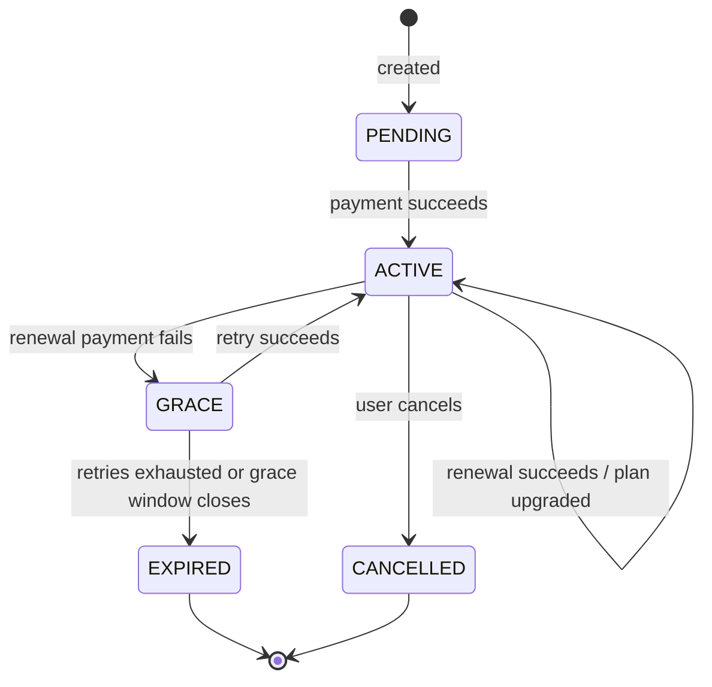

# FitFlex — Subscription Lifecycle Management System

A production-grade subscription billing platform built with **Spring Boot 3** and **React 19**.
It handles the parts of recurring billing that are easy to describe and hard to get right:
automated renewals, failed-payment retries with a grace period, prorated mid-cycle upgrades,
metered add-ons, and coupon redemption — all backed by a finite-state machine and 139 tests.

**[▶ Live demo](https://fit-flex-subscription-service-manag.vercel.app)**

> Built solo — backend architected and implemented over one month, with a React frontend on top.

---

## Why this project

Most CRUD portfolio projects stop at "create, read, update, delete". Subscription billing
doesn't let you do that. A renewal can fail. A retry must not double-charge. An upgrade
mid-cycle owes the customer credit for days they already paid for. A subscription in a grace
period is neither active nor expired.

Every one of those is a state-transition problem with money attached, and that is what this
codebase is actually about.

---

## Core capabilities

### 1. Finite-state subscription lifecycle

Five states, with every transition guarded by explicit preconditions:



### 2. Automated recurring billing

Two Spring `@Scheduled` cron jobs, pinned to `Asia/Kolkata`:

| Job | Cron | What it does |
|---|---|---|
| `RenewalScheduler` | `0 0 0 * * *` (00:00) | Charges every `ACTIVE` subscription whose `endDate` has arrived and has `autoRenew = true` |
| `DunningScheduler` | `0 5 0 * * *` (00:05) | Retries every `GRACE` subscription whose `nextRetryDate` has arrived |

Each job iterates subscriptions independently inside a try/catch, so one bad row can't abort
the whole nightly batch.

### 3. Dunning management (failed-payment recovery)

When a renewal fails, the subscription drops to `GRACE` rather than dying:

- **Up to 3 retry attempts**, one per day, scheduled via `nextRetryDate`
- **A 3-day grace window** (`graceEndDate`) acting as a hard deadline — even if the attempt
  counter hasn't reached 3, a subscription past its grace window expires immediately instead of
  attempting another charge. This is a deliberate safety net for the case where downtime delays
  a retry and the schedule drifts.
- **Every attempt is written to `DunningLog`** — attempt number, status, failure reason, and the
  next scheduled retry — so the recovery history is auditable after the fact
- **Dunning notifications** dispatched on each failure via `NotificationService`

Recovery is symmetric: a successful retry resets `renewalAttempts`, clears both date fields,
restores `autoRenew`, and rolls the billing period forward.

### 4. Prorated mid-cycle upgrades

Upgrading from Basic to Pro on day 12 of a 30-day cycle shouldn't cost full price. The upgrade
path computes:

```
pricePerDay    = oldPlan.price / oldPlan.durationDays
priceConsumed  = pricePerDay × daysUsed          (capped at oldPlan.price)
amountDue      = newPlan.price − (oldPlan.price − priceConsumed)
```

Deliberate design decisions in this flow:

- **Upgrades only.** Downgrades are rejected rather than silently issuing a refund the system
  has no mechanism to pay out.
- **Existing add-ons are never re-charged or credited.** They were paid for at attach time, so
  unused units carry forward free; only newly requested add-ons are billed.
- **Failed payment is a no-op.** The old plan is still paid for and still valid, so the
  subscription is left exactly as it was rather than being pushed into a broken half-state.
- **Optional wallet balance** can offset the amount due before the card is charged.

### 5. Metered, usage-based add-ons

Add-ons are tracked per billing cycle via a `SubscriptionAddOn` join entity holding
`unitsIncluded`, `unitsUsed`, `billingCycleStart` and `billingCycleEnd`. Attaching an add-on
to a subscription that already has it *tops up* the included units rather than creating a
duplicate row, and every renewal resets `unitsUsed` and realigns the cycle window.

### 6. Coupons

Three discount types (`PERCENTAGE`, `AMOUNT`, `BOTH`) with redemption tracked in a separate
`CouponUsage` entity, so per-user usage limits are enforceable independent of the coupon record.

### 7. Security

- **Stateless JWT** authentication (`jjwt` 0.12.7) via a custom `JwtAuthenticationFilter`
- **BCrypt** password hashing
- **Two roles** (`USER`, `ADMIN`) with method-level `@PreAuthorize` on every non-public endpoint
- **Ownership checks, not just role checks** — dedicated security beans (`SubscriptionSecurity`,
  `PaymentSecurity`, `UserSecurity`, `AddOnSecurity`) back expressions like
  `hasRole('ADMIN') or @subscriptionSecurity.isOwner(#id)`, so a `USER` can read *their* payment
  but not somebody else's
- **No secrets in the repo** — `DB_PASSWORD` and `JWT_SECRET` are env vars with no fallback
  defaults, so the app refuses to start unconfigured rather than booting with a known key
- **CORS allowlist** driven by `CORS_ALLOWED_ORIGINS`

---

## Tech stack

**Backend**
`Java 17` · `Spring Boot 3.5.15` · `Spring Data JPA` · `Hibernate` · `Spring Security` ·
`JWT (jjwt)` · `Spring Scheduler` · `Bean Validation` · `Lombok` · `Maven` · `MySQL 8`

**Frontend**
`React 19` · `Vite 8` · `TailwindCSS 4` · `shadcn/ui` (Radix) · `TanStack Query` ·
`React Router 7` · `React Hook Form` + `Zod` · `Recharts` · `Sonner`

**Testing**
`JUnit 5` · `Mockito` · `MockMvc` · `H2` (in-memory)

---

## Architecture

```
Controller  →  Service  →  Repository  →  MySQL
    ↕            ↕
   DTOs      Scheduler
```

A conventional layered design, applied strictly:

- **Controllers** stay thin — validation annotations, authorization expressions, delegation.
- **Services** own all business logic and transaction boundaries (`@Transactional`).
- **DTOs** at every boundary. Entities are never serialized directly to the client, which keeps
  lazy-loading and over-exposure problems out of the API surface.
- **`GlobalExceptionHandler`** centralizes error responses so controllers don't each invent
  their own error shape.
- **`PaymentGatewaySimulator`** stands in for a real PSP with a deterministic success/failure
  rule, which is what makes the failure paths testable at all.

### Domain model

9 entities, `User → Subscription → Payment` at the core:

| Entity | Role |
|---|---|
| `User` | Account, role, wallet balance |
| `Plan` | Catalogue item — price, duration, tier (`BASIC` / `PRO` / `PREMIUM`) |
| `Subscription` | The state machine: status, dates, renewal attempts, grace/retry dates |
| `Payment` | Immutable transaction record — type, method, status |
| `Coupon` / `CouponUsage` | Discount definition and per-user redemption tracking |
| `AddOn` / `SubscriptionAddOn` | Add-on catalogue and per-subscription metered usage |
| `DunningLog` | Audit trail of every failed-renewal recovery attempt |

---

## API

**33 REST endpoints** across 7 controllers.

<details>
<summary><strong>Subscriptions</strong> — <code>/subscriptions</code></summary>

| Method | Path | Access |
|---|---|---|
| `POST` | `/subscriptions` | `USER` |
| `GET` | `/subscriptions/{id}` | Admin or owner |
| `GET` | `/subscriptions/user/{userId}` | Admin or owner |
| `GET` | `/subscriptions` | `ADMIN` |
| `PUT` | `/subscriptions/change-plan` | Admin or owner |
| `PUT` | `/subscriptions/{id}/cancel` | Admin or owner |
| `POST` | `/subscriptions/{id}/test-renewal` | `ADMIN` |
| `POST` | `/subscriptions/{id}/test-retry` | `ADMIN` |

The two `test-*` endpoints exist so the renewal and dunning flows can be exercised on demand
instead of waiting for a real midnight cron and a real 30-day cycle. They call the **same**
`renewSubscription` / `retryPayment` methods the schedulers call — only the date fast-forward
is test-only.

</details>

<details>
<summary><strong>Add-ons</strong> — <code>/addons</code></summary>

| Method | Path | Access |
|---|---|---|
| `POST` | `/addons` | `ADMIN` |
| `GET` | `/addons` | Public |
| `POST` | `/addons/attach` | Admin or subscription owner |
| `POST` | `/addons/usage` | Admin or subscription owner |
| `GET` | `/addons/subscription/{subscriptionId}` | Admin or owner |

</details>

<details>
<summary><strong>Plans, Payments, Coupons, Users, Auth</strong></summary>

| Method | Path | Access |
|---|---|---|
| `POST` | `/auth/login` | Public |
| `GET` | `/plans`, `/plans/{id}` | Public |
| `POST` `PUT` `DELETE` | `/plans`, `/plans/{id}` | `ADMIN` |
| `GET` | `/payments/{id}` | Admin or owner |
| `GET` | `/payments` | `ADMIN` |
| `GET` | `/payments/subscription/{subscriptionId}` | Admin or owner |
| `POST` `GET` `PUT` `DELETE` | `/coupons`, `/coupons/{id}` | `ADMIN` |
| `GET` | `/coupons/code/{code}` | Authenticated |
| `POST` | `/users` | Public (registration) |
| `GET` | `/users` | `ADMIN` |
| `GET` `PUT` | `/users/{id}` | Admin or owner |
| `DELETE` | `/users/{id}` | `ADMIN` |

</details>

---

## Testing

**139 test methods** across three layers:

| Layer | Tooling | Covers |
|---|---|---|
| Service (unit) | JUnit 5 + Mockito | State transitions, billing arithmetic, proration, dunning attempt counting, edge cases |
| Controller | MockMvc | Request/response contracts, validation, authorization rules |
| Integration | Spring Boot Test + H2 | Full request → DB round trips |

```bash
cd subscription-service
./mvnw test
```

---

## Running locally

**Prerequisites:** Java 17+, Maven, MySQL 8, Node 18+

### Backend

```bash
cd subscription-service
```

Create the database:

```sql
CREATE DATABASE subscription_db;
```

Set the required environment variables:

| Variable | Required | Default | Notes |
|---|---|---|---|
| `DB_URL` | no | `jdbc:mysql://localhost:3306/subscription_db` | |
| `DB_USERNAME` | no | `root` | |
| `DB_PASSWORD` | **yes** | — | No default; app won't start without it |
| `JWT_SECRET` | **yes** | — | No default; use a long random string |
| `JWT_EXPIRATION` | no | `86400000` | 24h, in ms |
| `PORT` | no | `8080` | |
| `CORS_ALLOWED_ORIGINS` | no | `http://localhost:3000` | Comma-separated |
| `admin.seed.email` | **yes** | — | Seeds the initial admin account on first boot |
| `admin.seed.password` | **yes** | — | Seeds the initial admin account on first boot |

Then run:

```bash
./mvnw spring-boot:run
```

Hibernate creates the schema on first boot (`ddl-auto=update`), and `DataInitializer` seeds a
single admin account if one doesn't already exist.

### Frontend

```bash
cd frontend
npm install
npm run dev
```

---

## Project structure

```
subscription-service/
├── subscription-service/              # Spring Boot backend
│   └── src/main/java/com/fit/subscription/
│       ├── config/                    # SecurityConfig, DataInitializer
│       ├── controller/                # 7 REST controllers
│       ├── dto/                       # Request/response DTOs
│       ├── entity/                    # 9 JPA entities
│       ├── enums/                     # SubscriptionStatus, PaymentType, …
│       ├── exception/                 # GlobalExceptionHandler
│       ├── repository/                # Spring Data JPA repositories
│       ├── scheduler/                 # RenewalScheduler, DunningScheduler
│       ├── security/                  # JWT filter, ownership-check beans
│       └── service/                   # Business logic
└── frontend/                          # React + Vite
    └── src/
        ├── api/                       # Axios clients per resource
        ├── components/                # Layout, shared, shadcn/ui
        ├── context/                   # AuthContext
        ├── lib/                       # Pricing, validation, formatting
        └── pages/                     # public / member / admin
```

---

## Known limitations

Stated plainly, because they were choices rather than oversights:

- **Payments are simulated.** `PaymentGatewaySimulator` decides success/failure deterministically
  from the transaction ID. Swapping in a real PSP means replacing that one class.
- **Notifications are logged, not sent.** `NotificationService` has no SMTP integration wired up.
- **`ddl-auto=update`** is convenient for development but a migration tool (Flyway/Liquibase)
  would be the right call for real production use.
- **Downgrades are unsupported** by design — see the proration section above.

---

## Author

**Mahek Jameer Modi** — B.Tech CSE, VIT Chennai (2026)

[Portfolio](https://portfolio-mahek-modi.vercel.app) · [LinkedIn](https://www.linkedin.com/in/mahek-modi-858641278/) · [GitHub](https://github.com/mahekmodi04) · mahekmodi04@gmail.com

